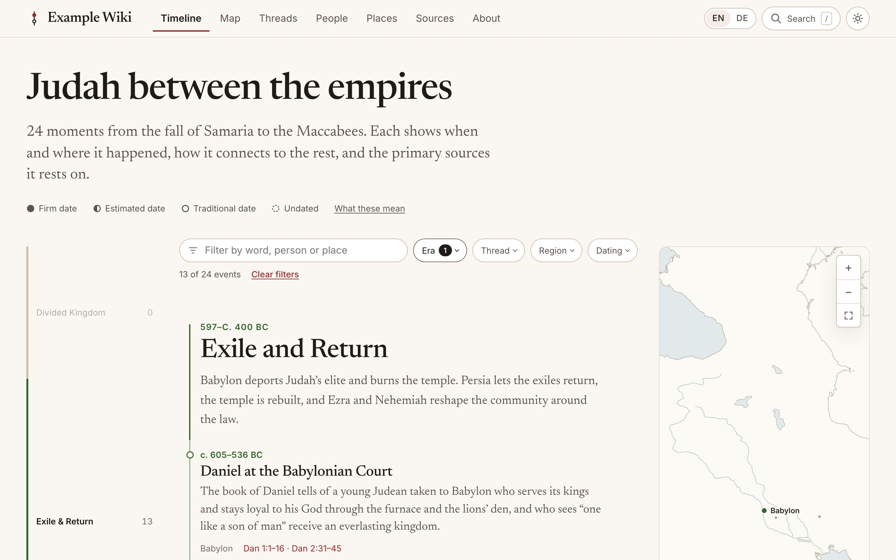

# chronowiki

An [Astro](https://astro.build) theme for history wikis built on a timeline. Every event is dated, placed on a map and tied to the primary sources it rests on.

It was built for [Christwiki](https://christwiki.org), which tells the story of Christianity in 361 events, and it works for any stretch of history: a city, a war, a science, a family.



## What a wiki gets

- **A timeline** grouped by era, with filters by era, thread, region, dating and word, and a map beside it that follows what is on screen.
- **Six kinds of entry**, all cross-linked: events, people, places, sources, threads (storylines that run across the eras) and eras.
- **Citations at passage level.** A sentence names the source and the passage that support it, and one click opens that passage.
- **Dates that say how sure they are.** Every date is labelled firm, estimated, traditional or undated, with a note on how it is known.
- **A map drawn by the site itself** from public-domain shapes: no tiles, no outside service, no modern borders.
- **Any number of languages.** The interface is translated message by message; a translation of an entry holds only its words, so dates, places and citations are shared and cannot drift apart. An entry without a translation is shown in the original language and says so.
- **The whole wiki as a book**, made with the site: an EPUB for any e-reader and a PDF for large e-paper tablets, with every link working inside the book.
- **Search**, a light and a dark theme, pages that can be read without JavaScript, and accessibility tested with axe against WCAG 2.1 A and AA.
- **Tools** that check every entry before the site builds: schemas, links between entries, citations, and every external link.
- **A static site**: no server, no database, no trackers, no outside requests.

## Start a wiki

Requires Node 22.12 or newer.

```bash
npx github:christwiki/chronowiki init my-wiki
```

```bash
cd my-wiki && npm install && npm run dev
```

The new wiki holds the entries of the example, a stretch of the history of ancient Judah, so there is something to look at. Open `http://localhost:4321`, then replace the entries with your own.

## How a wiki is laid out

```
my-wiki/
  astro.config.mjs          the site's address, and one line that adds the theme
  wiki.config.ts            the wiki's name, languages and map regions
  src/
    content.config.ts       two lines: the theme's content collections
    content/
      eras/<id>.md          the chapters of the timeline
      events/<era>/<id>.md  what happened
      people/<id>.md
      places/<id>.md
      sources/<id>.md       the texts and objects that are cited
      threads/<id>.md       storylines across the eras
      pages/about.md        how the wiki is made
      i18n/<language>/…     translations
    styles/custom.css       the wiki's own colours and typefaces (optional)
```

There are no page templates in a wiki. The theme adds every page.

- **[docs/entries.md](docs/entries.md)** describes each kind of entry, the syntax for links and citations, and what the validator checks.
- **[docs/languages.md](docs/languages.md)** explains how to add a language and how to translate entries.

## Settings

`wiki.config.ts`:

```ts
import { defineWiki, english, german } from 'chronowiki/config';

export default defineWiki({
  name: 'Roma',
  repository: 'https://github.com/you/roma',
  license: { name: 'CC BY-SA 4.0', url: 'https://creativecommons.org/licenses/by-sa/4.0/' },
  locales: [
    english({
      messages: {
        site: { tagline: 'Rome on one timeline, tied to its primary sources.' },
        home: { title: 'Rome on one timeline' },
      },
    }),
    german({ status: 'preview' }),
  ],
  regions: [
    { id: 'italy', name: { en: 'Italy', de: 'Italien' } },
    { id: 'gaul', name: { en: 'Gaul', de: 'Gallien' } },
  ],
});
```

| Setting | |
|---|---|
| `name` | The wiki's name, in the header and in page titles. |
| `repository` | Where the wiki's files are kept. The footer links to it. Optional. |
| `license` | The licence of the text, named in the footer. Optional. |
| `favicon` | The wiki's own icon, a file in its `public/` folder. Without it the theme's mark is used. |
| `locales` | The languages. The first is the one the content is written in; its pages sit at the root, every other language under its code (`/de/…`). Default: English. |
| `regions` | The regions of the map, in the order the filters list them. Every place names one. A name is one string, or one per language. |
| `book` | `false` builds the wiki without its book. |

`english()` and `german()` come with the theme. Both take `messages`, which lays the wiki's own wording over the theme's, and `status`: a `preview` language is built by `npm run dev` and when `PREVIEW_LOCALES=true`, and left out of a release. The messages a wiki will want to make its own are `site.tagline`, `site.description`, `home.title`, `home.lead` and the four `confidence.<label>.example`; every message is in [`src/i18n/messages/en.ts`](src/i18n/messages/en.ts). A wiki that writes its years with BCE and CE overrides the `date` messages.

`astro.config.mjs`:

```js
import { defineConfig } from 'astro/config';
import chronowiki from 'chronowiki';

export default defineConfig({
  site: 'https://example.org',
  integrations: [chronowiki({ css: ['./src/styles/custom.css'] })],
});
```

| Option | |
|---|---|
| `css` | The wiki's own stylesheets, loaded after the theme's. |
| `config` | Where the settings are, if not `wiki.config.ts` beside `astro.config.mjs`. |
| `search` | `false` builds without the search index. |

## Commands

In a wiki's folder:

| Command | What it does |
|---|---|
| `npm run dev` | Development server. Drafts are shown, and content errors are logged instead of stopping the page. |
| `npm run build` | Validate, build the site into `dist/` and build the search index. |
| `npx chronowiki validate` | Check every entry and the settings. `--strict` is the release check: no drafts, no orphans, every event independently checked. `--era <id>` checks one era and what its events refer to. |
| `npx chronowiki check-links` | Request every external link in the content and report the ones that fail. Results are cached for a week (`--no-cache` ignores them); `--only <text>` checks only matching links; `--bible` also checks one Bible-reader link per event. Sites that refuse automated requests are listed separately, to be opened by hand. |
| `npx chronowiki i18n status` | How much of each language is translated and what is out of date. Also `new` and `stamp`: see [docs/languages.md](docs/languages.md). |

Three environment variables change a build: `SHOW_DRAFTS=true` includes unfinished entries, `LENIENT_CONTENT=true` logs broken links and citations instead of failing, and `PREVIEW_LOCALES=true` builds the languages that are still in preview. All three are meant for work in progress, not for a release.

## The book

Every build also makes the wiki as a book, in each of its languages, and offers it on a page of its own (`/book/`):

- **`/book/<name>.epub`** for any e-reader: Kindle, Kobo, PocketBook, tolino, and reading apps. It embeds no typeface and sets no size, so the reader's own settings apply.
- **`/book/<name>.pdf`** for large e-paper tablets: reMarkable, Kindle Scribe, Boox, Supernote. Its pages are the size of a 10.3-inch screen, so it is read at full size.

The book holds what the site holds, in an order made for reading: the timeline era by era and event by event, then the threads, then people, places and sources in alphabetical order, then the method page. It is built for devices that have no browser and no back button:

- Every name in the text is a link to its entry in the book, and every person, place and source lists the events it belongs to. There is always a way on and a way back.
- A citation leads to the source's entry, which says what the source is and where it can be read. Bible references are plain words.
- In the PDF every list of links shows the page each one leads to, and the foot of every page links to the contents and to each part.
- An event names the events before and after it, what it grows out of and leads to, and its neighbours on each thread.

Because the book is made by the same build as the site, it is never behind it: a corrected entry is corrected in the next book. The day it was made is on its cover.

The PDF is typeset with [Typst](https://typst.app); nothing has to be installed beyond `npm install`. `docs/book.md` describes how the book is put together and how to change it.

## The wiki's own design

The theme's colours, typefaces and measures are custom properties in [`src/styles/tokens.css`](src/styles/tokens.css). A wiki redefines the ones it wants in a stylesheet of its own and names that stylesheet in the `css` option:

```css
:root {
  --accent: light-dark(#1f5fbf, #8ab8ff);
  --font-serif: 'Georgia', serif;
}
```

Each colour is given once for the light theme and once for the dark. Eras take their colours from sixteen hues, `--era-1` to `--era-16`; an era names one with `colour: era-4`, or leaves it out and the eras are spread evenly across them.

## Publishing

`npm run build` writes the complete site to `dist/`. Copy that folder to any static host. Set `site` in `astro.config.mjs` to the wiki's public address, and `base` if it is served from a sub-path.

## What the theme assumes

- **Years are signed numbers**: negative is BC. Dates before the common era, ranges, approximate dates and undated events are all supported; times of day are not.
- **Bible references are built in** (`[[bible:2 Kings 25:8-10]]`): checked against the books, chapters and verses that exist, written as each language writes them, and linked to a Bible reader. A wiki that does not cite the Bible never meets them.
- **The map shows the whole world** at 1:50,000,000, with finer coastlines for Europe, North Africa and the Near East. `npm run map-data` in this repository rebuilds both layers.
- **The kinds of source** are fixed: scripture, history, chronicle, letter, treatise, council, creed, law, liturgy, inscription, manuscript, artifact.

## Working on the theme

```bash
npm install
npm run dev        # the example wiki, at http://localhost:4321
npm test           # unit tests
npm run e2e        # browser and accessibility tests against the built example
npm run check      # types
```

| | |
|---|---|
| `integration.mjs` | the Astro integration: adds the pages, hands the wiki's settings to the theme, builds the search index |
| `src/routes/` | every page, once, for all languages |
| `src/components/`, `src/layouts/`, `src/styles/` | the design |
| `src/scripts/` | what runs in the browser: the timeline's filters, the map, search |
| `src/lib/` | the logic, as small tested libraries: dates, Bible references, prose and citations, the validator |
| `src/i18n/` | languages, messages, and the overlay that lays a translation over an entry |
| `src/content/` | the schemas of the entries and the content collections |
| `src/book/` | the wiki as a book: the model, the EPUB writer, the PDF writer and the cover |
| `src/config/` | `defineWiki()` and the loader for the tools |
| `cli/` | the `chronowiki` command |
| `example/` | the example wiki, which the tests run against and `init` copies |

## Licences

The theme is under the [MIT licence](LICENSE).

The entries of the example wiki in `example/src/content/` are from [Christwiki](https://github.com/christwiki/christwiki) and are under [CC BY-SA 4.0](https://creativecommons.org/licenses/by-sa/4.0/). They are there to be replaced; a wiki that keeps any of them keeps that licence for them.

Bundled with the theme: map shapes from [Natural Earth](https://www.naturalearthdata.com/) (public domain), and the typefaces Newsreader and Inter (SIL Open Font License 1.1).
